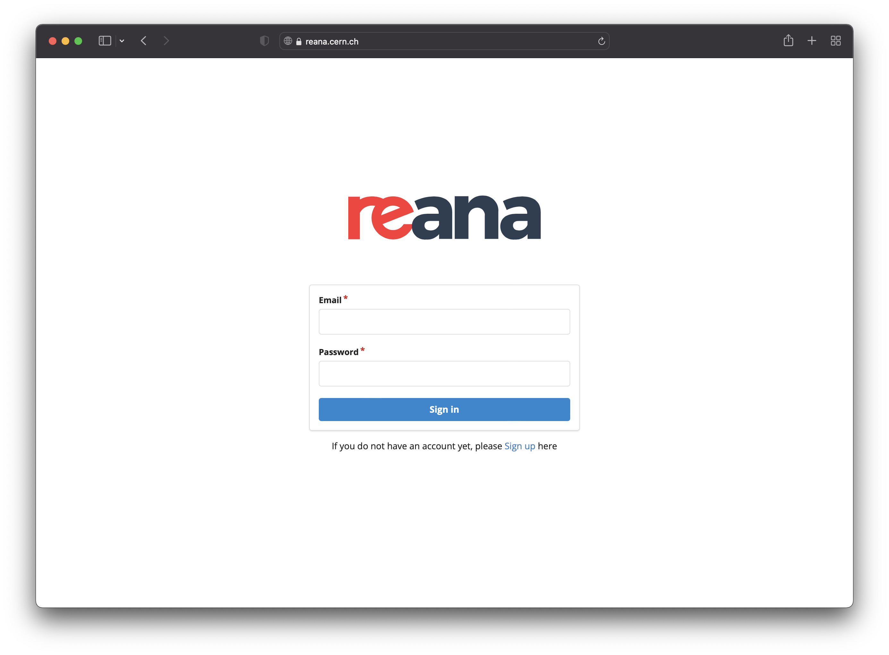
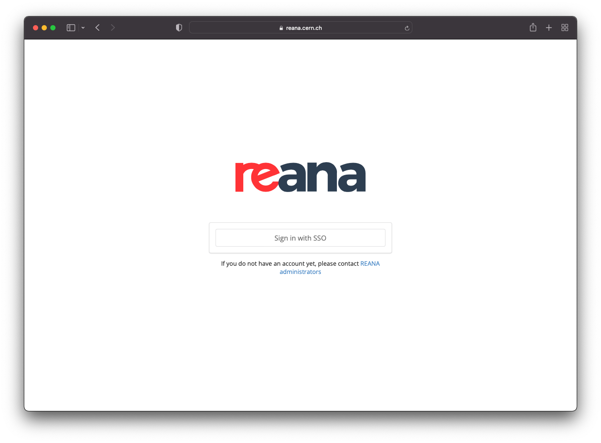

# Configuring user access

## User registration via sign up form

By exposing the REANA User Interface, the default configuration allows
users to sign-up.

When accessing the UI for the first time, users will be prompted with a
sign-in form and a link to the sign-up form:

After signing up, an email is sent to the user's email address for
confirmation. Once the email address is confirmed, the user can then ask
administrators for an access token.

If you would like to disable the email verification step, you can add
`REANA_USER_EMAIL_CONFIRMATION: false` Helm value to [`components.reana_server.environment`](https://github.com/reanahub/reana/tree/master/helm/reana).

If you would like to disable the sign-up form completely, and [add your
users manually](../../management/managing-users), you can configure
[`components.reana_ui.hide_signup`](https://github.com/reanahub/reana/tree/master/helm/reana)
Helm value accordingly.

## User registration via Single Sign-On

Handling of users with Single Sign-On (SSO) is also possible. Currently,
this is only available for CERN deployments via [`components.reana_ui.cern_sso`](https://github.com/reanahub/reana/tree/master/helm/reana)
Helm value. This configuration can be combined with local users or used
exclusively. When accessing the UI you will see a page like this:

When clicking on "Sign in with SSO" the users will be redirected to the
corresponding login page to enter their SSO provider credentials. Once
authenticated, they will be redirected back to REANA with their user
logged in.

You might also want to disable the local users functionality altogether
to rely only on SSO users. To do this, set [`components.reana_ui.local_users`]((https://github.com/reanahub/reana/tree/master/helm/reana))
Helm value to `false`.
